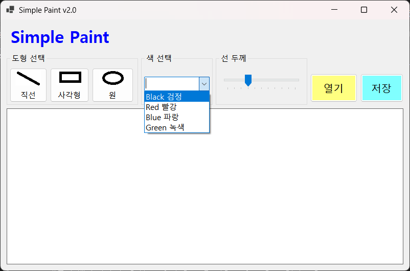

# (C# 코딩) 그림판 앱

## 개요
- C# 프로그래밍 학습
- 1줄 소개: 직선, 사각형, 원을 그릴 수 있는 그림판 프로그래밍
- 사용한 플랫폼: 
  -C#, .NET Windows Forms, Visual Studio, GitHub
- 사용한 컨트롤:
  - Label, Button, ComboBox, TrackBar, GroupBox, PictureBox
- 사용한 기술과 구현한 기능:
  - Visual Studio를 사용해 기본 UI배치 및 선택 기능 구현

## 실행 화면 (과제1)
- 코드의 실행 스크린샷과 구현 내용 설명

- 구현한 내용 (위 그림 참조)
   - 컨트롤 배치: Label, Button, ComboBox, TrackBar, GroupBox, PictureBox
   - 컨트롤의 기본적인 속성 설정
   - 컨트롤의 이름 설정
   - 도형선택: Button을 직선, 사각형, 원으로 설정하여 선택할 수 있도록 구현
   - 색상선택: ComboBox를 사용하여 색상을 선택할 수 있도록 구현
   - 선굵기선택: TrackBar를 사용하여 선의 굵기를 선택할 수 있도록 구현